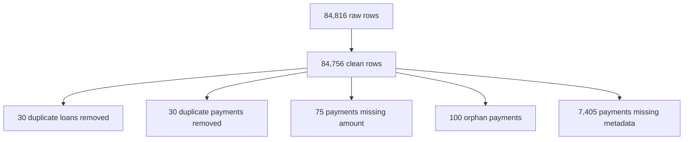

# Quality Snapshot

```mermaid
flowchart TD
    A["84,816 raw rows"] --> B["84,756 clean rows"]
    B --> C["30 duplicate loans removed"]
    B --> D["30 duplicate payments removed"]
    B --> E["75 payments missing amount"]
    B --> F["100 orphan payments"]
    B --> G["7,405 payments missing metadata"]
```

Use this in NotebookLM, GitHub previews, or presentation prep when you need a fast visual of the quality story.
